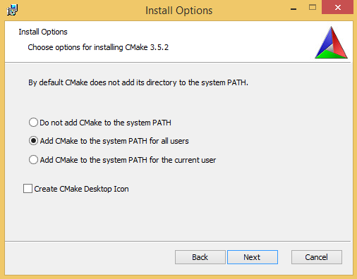

# Настройка инструментов

## Ubuntu (14.04 и старше)

- установите пакеты `lemon`, `clang`, `llvm-dev`, `cmake`
- архив версий `clang` и `llvm-dev` для Ubuntu есть [на сайте llvm](http://llvm.org/apt/)
- лучше настроить IDE для использования компилятора clang 3.4 и старше или GCC 5.0 и старше

## Windows (Windows 7 и старше)

#### Для примеров интерпретатора (lemon-1 ... lemon-8)

Скачайте два файла с исходным кодом LEMON [со страницы на сайте hwaci.com](http://www.hwaci.com/sw/lemon/). Соберите их как проект с помощью Visual C++ или любого другого компилятора.

#### Для примеров компилятора (llvm-1 ... llvm-2)

- [Загрузите с cmake.org](https://cmake.org/download/) и установите CMake для Windows, выбрав на сайте MSI-установщик. При установке следует убедиться, что CMake будет добавлен в переменную окружения PATH:

- [Загрузите с python.org](https://www.python.org/downloads/) и установите Python (на данный момент нужна версия 2, а не 3)
- [Загрузите с llvm.org](http://llvm.org/releases/) архив с исходным кодом последней стабильной версии LLVM.
- Распакуйте архив в каталог `llvm.src` так, чтобы файл CMakeLists.txt и все файлы рядом с ним лежали непосредственно в `llvm.src`
- Создайте рядом каталог `llvm.cmake` и перейдите туда в консольной оболочке `Far Manager` или в `cmd.exe`
- Для генерации проекта VS2015 надо выполнить команду `'cmake -G "Visual Studio 14" ../llvm.src'`. Для VS2013 следует указать версию "12" вместо "14"
- Откройте `llvm.cmake/LLVM.sln` в Visual Studio и соберите проекты `Tools/llc`, `Tools/llvm-config`. В процессе будут также собраны все статические библиотеки LLVM, т.к. от них зависят обе утилиты.
