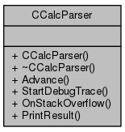

# Калькулятор на основе LALR-парсера

Калькулятор читает ввод построчно и интерпретирует каждую строку как одно выражение. Любая синтаксическая ошибка прерывает работу калькулятора.

##### Ввод
```
21 + 13 - (1.12 * 2 - 1.51 / 2)
```

##### Вывод
```
32.515
```

### Детали реализации

- Для генерации LALR-парсера используется генератор парсеров Lemon и его собственный язык описания грамматик. Язык утилиты Lemon позволяет описать атрибутную грамматику в формате BNF (Форма Бэкуса-Наура). Другие генераторы парсеров, такие как Bison, могут использовать более совершенный EBNF (Extended BNF).
- Для вызова утилиты Lemon и переименования выходного файла `CalcGrammar.c` в `CalcGrammar.cpp` используется Bash-скрипт.
- Lemon генерирует LALR-парсер на языке C, который инкапсулирован в нескольких функциях семейства `ParseCalcGrammar*`. После переименования сгенерированный код окажется в `CalcGrammar.cpp`
- Lemon также генерирует объявления токенов как целочисленных констант. Эти объявления окажутся в файле `CalcGrammar.h`.
- Использовать код в стиле языка C напрямую небезопасно. В примере для оборачивания сгенерированного кода написан C++ класс `CCalcParser`.



- Написанный "вручную" C++ класс `CCalcLexer` предоставляет токены, используя целочисленные константы токенов из `CalcGrammar.h`


### Отладочная трассировка

Вы можете включить встроенный в Lemon режим отладочной печати, чтобы подробнее изучить механизмы работы LALR-парсера. Просто раскомментируйте код, вызывающий метод `CCalcParser::StartDebugTrace`.

### Системные требования

- Для ОС Ubuntu: установите пакет `lemon`
- Для ОС Windows: соберите Lemon из [исходных кодов (hwaci.com)](http://www.hwaci.com/sw/lemon/). Исходники Lemon состоят всего из двух файлов, `lemon.c` и `lempar.c`. Используйте любой современный компилятор C/C++.
